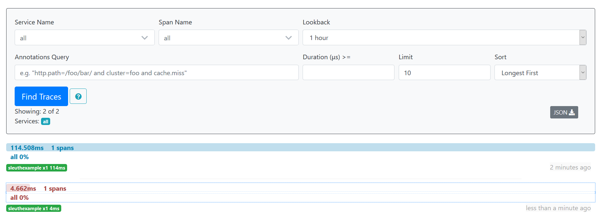
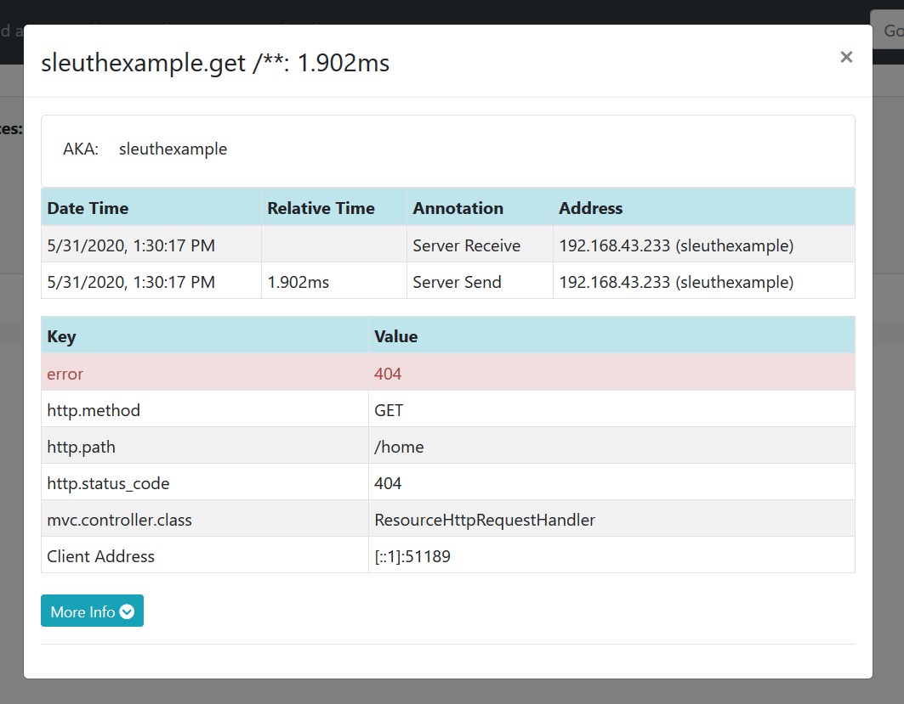

#SpringMicroservicesLogTracing
<h2>Spring Cloud Microservices Log Tracing example using Sleuth and Zipkin</h2>

In this example we create Zipkin server to trace all logs from microservices

<h3>Dependencies for Zipkin server :</h3>

	<dependencies>	
		<dependency>	
			<groupId>org.springframework.boot</groupId>	
			<artifactId>spring-boot-starter-web</artifactId>	
						<exclusions>
					<exclusion>
						<groupId>ch.qos.logback</groupId>
						<artifactId>logback-classic</artifactId>
					</exclusion>
					<exclusion>
						<groupId>org.apache.logging.log4j</groupId>
						<artifactId>log4j-to-slf4j</artifactId>
					</exclusion>
				</exclusions>	
			</dependency>	
		<dependency>	
			<groupId>org.springframework.boot</groupId>		
			<artifactId>spring-boot-devtools</artifactId>		
			<scope>runtime</scope>	
		</dependency>	
		<dependency>		
			<groupId>org.springframework.boot</groupId>		
			<artifactId>spring-boot-starter-test</artifactId>		
			<scope>test</scope>	
		</dependency>	
		<dependency>	
			<groupId>io.zipkin.java</groupId>	
			<artifactId>zipkin-server</artifactId>	
			<version>2.11.5</version>
		</dependency>	
		<dependency>	
			<groupId>io.zipkin.java</groupId>	
			<artifactId>zipkin-autoconfigure-ui</artifactId>	
			<version>2.11.5</version>	
		</dependency>
	</dependencies>
	
<h3>Dependencies for Sleuth microservice:</h3>

	  <dependencies>   
			<dependency>
			    <groupId>org.springframework.cloud</groupId>
			    <artifactId>spring-cloud-starter-sleuth</artifactId>
			    <version>2.0.2.RELEASE</version>
			</dependency>
	      <dependency>
		 <groupId>org.springframework.boot</groupId>
		 <artifactId>spring-boot-starter-web</artifactId>
	      </dependency> 
			<dependency>
				<groupId>org.springframework.cloud</groupId>
				<artifactId>spring-cloud-starter-zipkin</artifactId>
				<version>2.0.2.RELEASE</version>
			</dependency>
	   </dependencies>

 <h3>Zipkin server main class:</h3>
   
		@SpringBootApplication
		@EnableZipkinServer
		public class Main {

		public static void main(String[] args) {
			
			SpringApplication.run(Main.class, args);

			}

		}
		
<h3>Sleuth microservice main class:</h3>

		@SpringBootApplication
		@RestController
		public class Main {

			private static final Logger LOG = Logger.getLogger(Main.class.getName());
			
			public static void main(String[] args) {
				
				SpringApplication.run(Main.class, args);
			}
			  @RequestMapping("/") 
			  public String home() { 
				
				LOG.log(Level.INFO, "Creating new log");
				
				return "Hello from microservice"; 

			  } 
		}
		
<h3>Zipkin server application.properties:</h3>
		
		spring.application.name=zipkinserver
		server.port:9411
		management.metrics.web.server.auto-time-requests=false
		
<h3>Sleuth microservice application.properties:</h3>	
	
		spring.application.name=SleuthExample
		spring.zipkin.baseUrl=http://localhost:9411/
		spring.sleuth.sampler.probability = 1.0
	
<h3>Final result:</h3>		

If we go to: http://localhost:8080/ we can see: "Hello from microservice" message

If we go to: http://localhost:8080/home we can see: "Error type=Not Found, status=404" message

	
<h3>Then we can go to zipkin server to see bouth logs:</h3>	
		

		
<h3>If we select the red log related to the  http://localhost:8080/home request, we can see the details of error log:</h3>	
		

